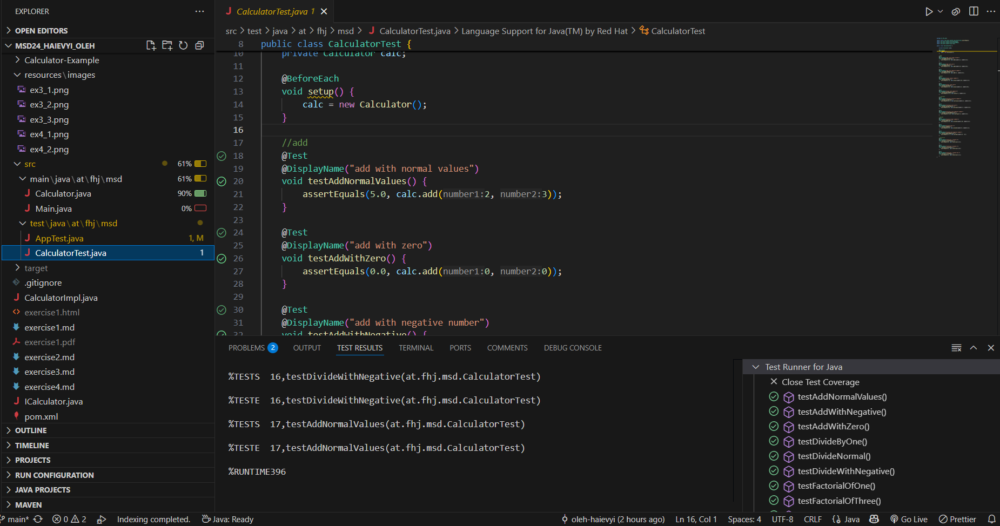
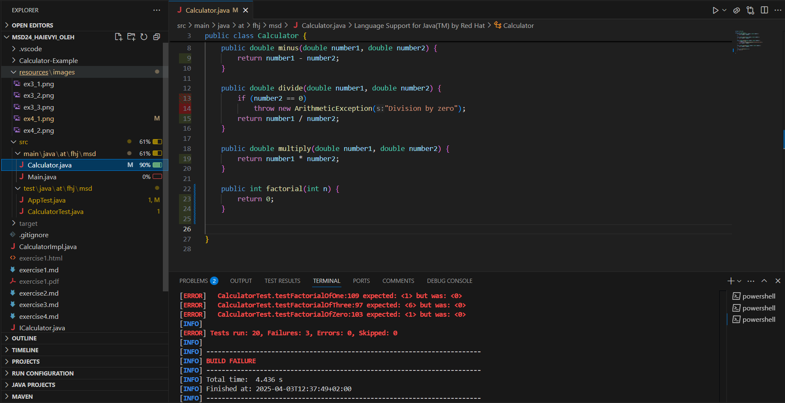

# Mein Calculator-Projekt  

Hallo! Dies ist mein Projekt für einen Taschenrechner. Es macht Mathematik mit Java einfacher. Ich möchte Markdown lernen und später Pandoc benutzen.  

## Was kann es?  
Der Calculator kann Folgendes:  
- **Addieren**: Zwei Zahlen zusammenrechnen  
- **Subtrahieren**: Eine Zahl von einer anderen abziehen  
- **Dividieren**: Zwei Zahlen teilen (nicht durch 0!)  
- **Multiplizieren**: Zwei Zahlen miteinander multiplizieren  
- **Fakultät berechnen**: z. B. 3! = 6  

## Wie funktioniert es?  
Ich habe den Code in Java geschrieben. Es gibt die Klasse `Calculator.java` mit allen Methoden.  
Beispiel:  
- `add(2, 3)` gibt `5` zurück.  
- `divide(5, 0)` führt zu einem Fehler.  
- `factorial(3)` gibt `6` zurück.  

## Änderungen in Übung 04  
In dieser Übung haben wir:  
- Die Datei `pom.xml` erweitert und JUnit 5 hinzugefügt  
- Eine Testklasse `CalculatorTest.java` geschrieben  
- 15 Unit-Tests erstellt für `add`, `minus`, `multiply`, `divide` und `factorial`  
- Die Tests mit `mvn test` ausgeführt und Screenshot gemacht  

## Übungen  
- [Exercise1](./exercise1.md)  
- [Exercise2](exercise2.md)  
- [Exercise3](exercise3.md)  
- [Exercise4](exercise4.md) ✅  
- Exercise5 (kommt bald)  
- Exercise6 (in Planung)  

## Struktur des Projekts  
Das Projekt enthält folgende Dateien:  
- `README.md` – Diese Datei  
- `exercise4.md` – Dokumentation dieser Übung  
- `Calculator.java` – Die Implementierung des Rechners  
- `Main.java` – Startpunkt des Programms  
- `pom.xml` – Die Maven-Konfigurationsdatei  
- `CalculatorTest.java` – JUnit-Testklasse

## Tests und Screenshots

Diese Übung verwendet Test-Driven Development (TDD) für die Methode `factorial()`.

Die Tests wurden mit `mvn test` ausgeführt.  
Es gibt zwei Screenshots:

- ✅ **Erfolgreicher Testlauf** – alle Tests sind OK  
- ❌ **Fehlerhafter Testlauf** – ein absichtlich falsch geschriebener Test

### Erfolgreicher Testlauf

### Fehlerhafter Testlauf

## Über mich
> *Oleh Haievyi* – Student an der FH Joanneum  

- **Mein GitHub-Profil:** [Oleh Haievyi](https://github.com/oleh-haievyi)  
- **Fachhochschule:** [FH Joanneum](https://www.fh-joanneum.at/)  