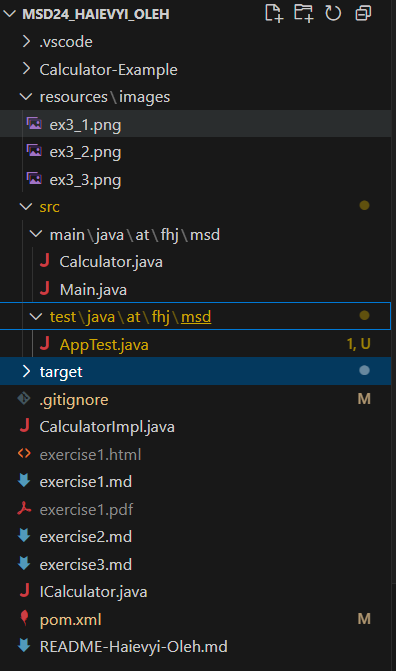
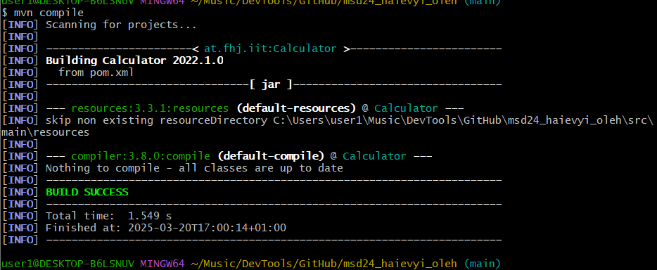
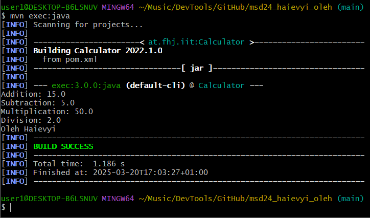

# Mein Calculator-Projekt  

Hallo! Dies ist mein Projekt für einen Taschenrechner. Es macht Mathematik mit Java einfacher. Ich möchte Markdown lernen und später Pandoc benutzen.  

## Was kann es?  
Der Calculator kann Folgendes:  
- **Addieren**: Zwei Zahlen zusammenrechnen  
- **Subtrahieren**: Eine Zahl von einer anderen abziehen  
- **Dividieren**: Zwei Zahlen teilen (nicht durch 0!)  
- **Multiplizieren**: Zwei Zahlen miteinander multiplizieren  

## Wie funktioniert es?  
Ich habe den Code in Java geschrieben. Es gibt ein Interface `ICalculator` und die Klasse `CalculatorImpl`.  
Beispiel:  
- `add(2, 3)` gibt `5` zurück.  
- `divide(5, 0)` führt zu einem Fehler.  

## Änderungen in dieser Übung  
In dieser Übung haben wir:  
- Ein Maven-Projekt erstellt und mit Git versioniert.  
- Die Datei `pom.xml` angepasst und Abhängigkeiten sowie Plugins hinzugefügt.  
- Die Java-Klassen `Calculator` und `Main` im Paket `at.fhj.msd` erstellt.  
- Das Projekt erfolgreich mit `mvn compile` kompiliert.  
- Die Anwendung mit `mvn exec:java` gestartet.  
- Screenshots zur Dokumentation erstellt und gespeichert.  

## Übungen  
- [Exercise1](./exercise1.md)  
- [Exercise2](exercise2.md)  
- [Exercise3](exercise3.md)  
- Exercise4 (noch nicht vorhanden)  
- Exercise5 (kommt bald)  
- Exercise6 (in Planung)  

## Struktur des Projekts  
Das Projekt enthält folgende Dateien:  
- `README.md` – Diese Datei  
- `exercise1.md` – Dokumentation der ersten Übung  
- `exercise3.md` – Dokumentation dieser Übung  
- `CalculatorImpl.java` – Die Implementierung des Rechners  
- `ICalculator.java` – Das Interface für den Rechner  
- `pom.xml` – Die Maven-Konfigurationsdatei  

## Installation & Nutzung  
1. Java (Version 11 oder höher) installieren  
2. Den Code in Eclipse, IntelliJ oder einer anderen IDE laden  
3. Maven für die Nutzung von `pom.xml` installieren  
4. Die Datei `CalculatorImpl` starten  

## Screenshots dieser Übung  
### 🔹 **Projektstruktur**
  

### 🔹 **Erfolgreiche Kompilierung (`mvn compile`)**
  

### 🔹 **Erfolgreiche Ausführung (`mvn exec:java`)**
  

## Über mich
>

>*Oleh Haievyi* – Student an der FH Joanneum  

- **Mein GitHub-Profil:** [Oleh Haievyi](https://github.com/oleh-haievyi)  
- **Fachhochschule:** [FH Joanneum](https://www.fh-joanneum.at/)  
