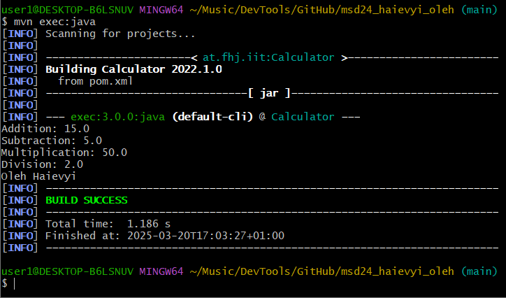

# Übung 3: Maven und Git

## 1. Ziel der Übung
In dieser Übung wurde ein Maven-Projekt erstellt und mit Git versioniert. Das Ziel war es, die grundlegende Nutzung von Maven zu verstehen, ein Java-Projekt zu kompilieren und es über die Konsole auszuführen.

---

## 2. Schritte der Umsetzung
1. Ein Maven-Projekt wurde mit `mvn archetype:generate` erstellt.
2. Die Datei `pom.xml` wurde angepasst und die notwendigen Abhängigkeiten sowie Plugins wurden hinzugefügt.
3. Die Java-Klassen `Calculator` und `Main` wurden im Paket `at.fhj.msd` erstellt.
4. Das Projekt wurde erfolgreich mit `mvn compile` kompiliert.
5. Die Anwendung wurde mit `mvn exec:java` gestartet.

---

## 3. Screenshots der Umsetzung

### 🔹 **Projektstruktur**


### 🔹 **Erfolgreiche Kompilierung (`mvn compile`)**


### 🔹 **Erfolgreiche Ausführung (`mvn exec:java`)**


---

## 4. Konsolenausgabe der Anwendung
```sh
Addition: 15.0
Subtraction: 5.0
Multiplication: 50.0
Division: 2.0
Oleh Haievyi
