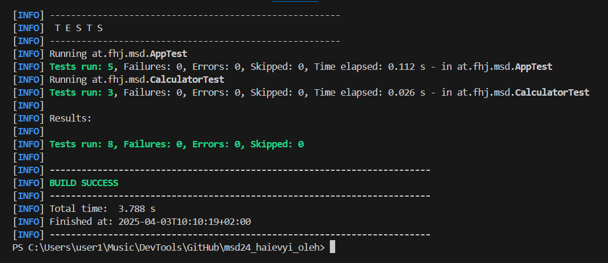

# Übung 04 – Source Code Testen

## What I did:

- I created test class for Calculator
- I test add method with 3 different cases
- Then I added tests for subtract, multiply, divide

## Test methods:

- add(2, 3) = 5
- add(0, 0) = 0
- add(-2, 3) = 1
- subtract(10, 3) = 7
- multiply(5, 2) = 10
- divide(10, 2) = 5

## Tools I used:

- JUnit 5
- Maven test
- I used mvn test to check if all test is ok

## Screenshot:

I run mvn test and all tests work. You can see it in screenshot:

