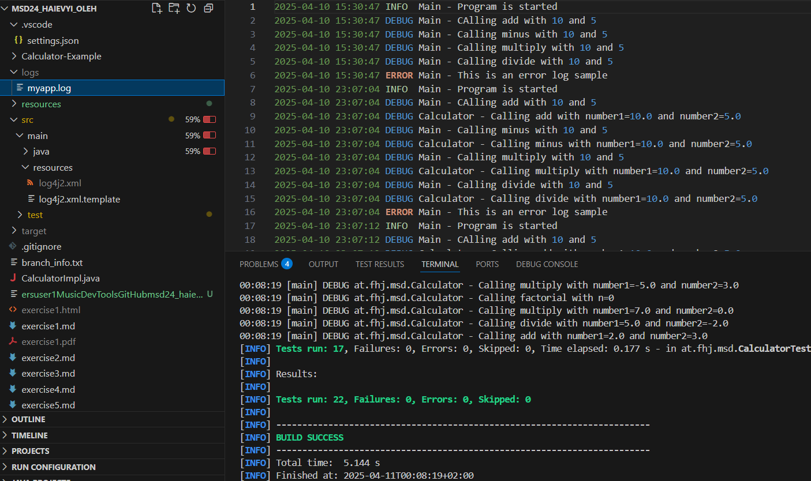

# Exercise5: Logging Documentation

This document explains the purpose of logging libraries, the log levels provided by Log4j, and the configuration options available. It also includes screenshots (Abbildungen) that document various steps of our work.

---

## 1. Why are logging libraries used?

Logging libraries are used to record events in a program. They help developers debug and find errors while the application is running. Logging is useful for monitoring the program and for collecting important information when something goes wrong.

---

## 2. What log levels does Log4j have and what do they mean?

Log4j provides several log levels:

- **TRACE**: The most detailed level, used for tracing the program step by step.
- **DEBUG**: Used for recording debug information and showing detailed process flows.
- **INFO**: Displays general information about the application's runtime.
- **WARN**: Shows warning messages if something unexpected happens, but the program continues running.
- **ERROR**: Indicates error messages that require attention.
- **FATAL**: Reports critical errors that can cause the program to stop.

---

## 3. What configuration options does Log4j provide?

Log4j offers a variety of configuration options, including:

- **Appenders**: You can configure different appenders (e.g., Console, File) to direct log messages to various outputs.
- **Pattern Layouts**: You can customize the format of log messages using pattern layouts.
- **Log Levels**: You can set different log levels for different parts of your application.
- **Filters**: Filters can be applied to control which messages are recorded.

These configuration options help in managing and analyzing log data more effectively.

---

## 4. Abbildungen (Screenshots)

Below are the screenshots documenting important steps:

- **ex5_1.png**  
  *Description:* This screenshot shows the output of the `git status` command, indicating a clean working directory with all changes properly committed.  
  

- **ex5_2.png**  
  *Description:* This screenshot displays the console output of the running application, where you can see the log messages at different levels (INFO, DEBUG, ERROR).  
  

- **ex5_3.png**  
  *Description:* This screenshot shows the content of the log file (`logs/app.log`), confirming that log entries are being appended correctly.  
  

---

*End of documentation.*
