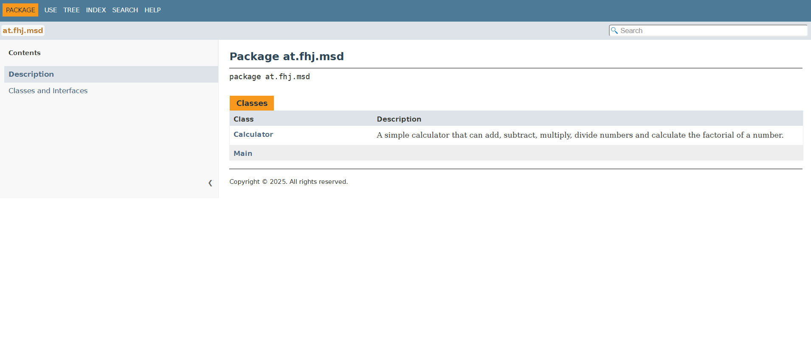

# Exercise 6 - Documentation

## Maven Site Configuration

- Site is created with Maven Site Plugin.
- `pom.xml` must include correct plugins and project information.
- `site.xml` defines navigation menu for the website.
- Markdown files are used for additional pages like FAQ or good style guide.
- Test reports from JUnit and coverage reports from JaCoCo are added automatically.

## Screenshots

### Screenshot: Start page with navigation menu (Home + Exercise 6 + Good Style)

### Screenshot: Javadoc API for Calculator

### Screenshot: JaCoCo Coverage Report

